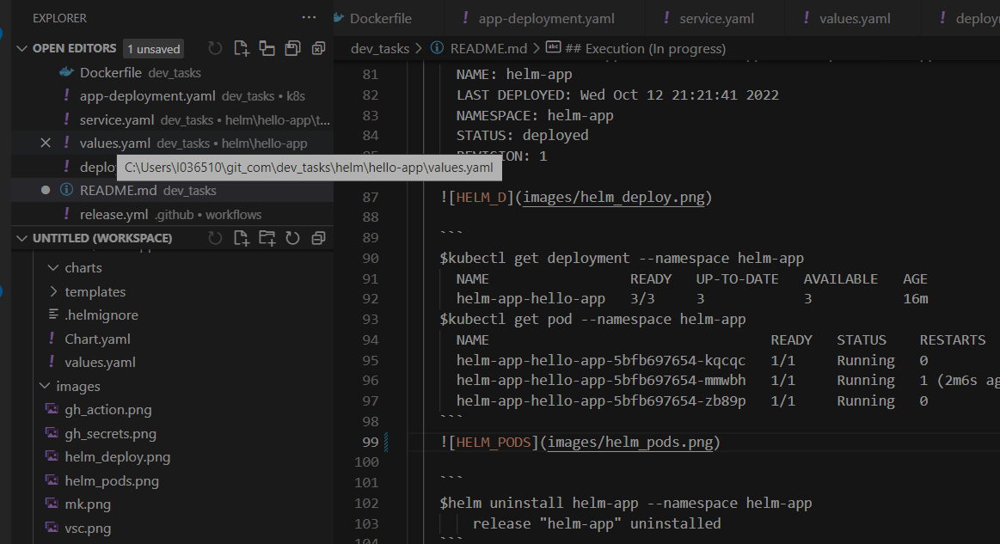
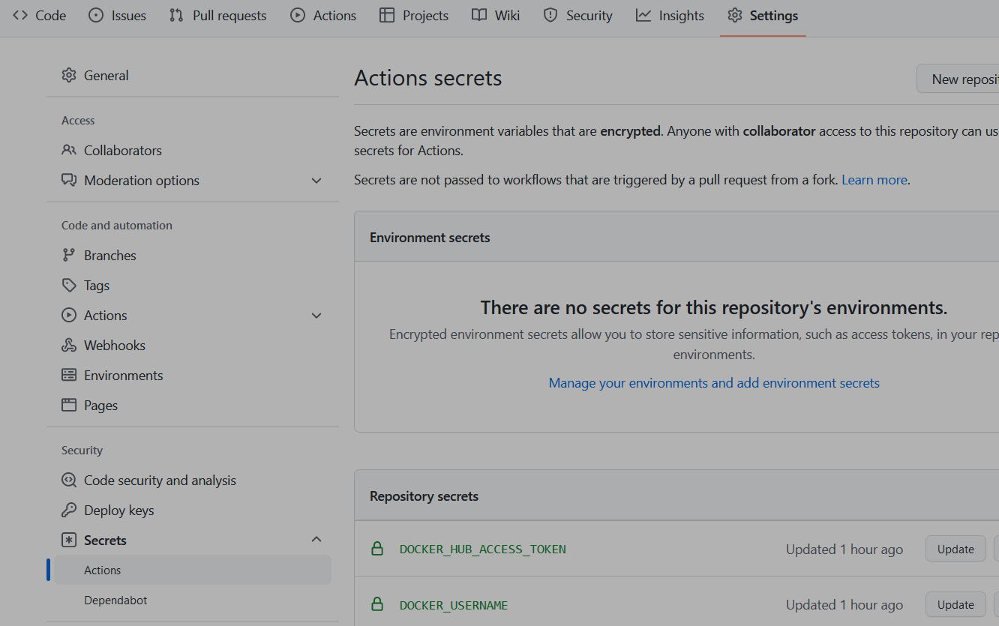
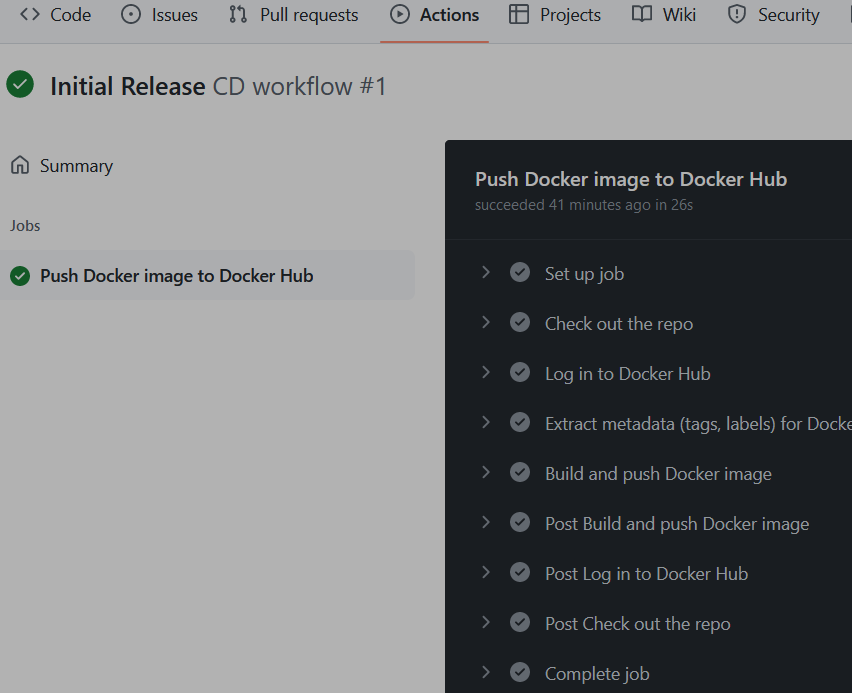
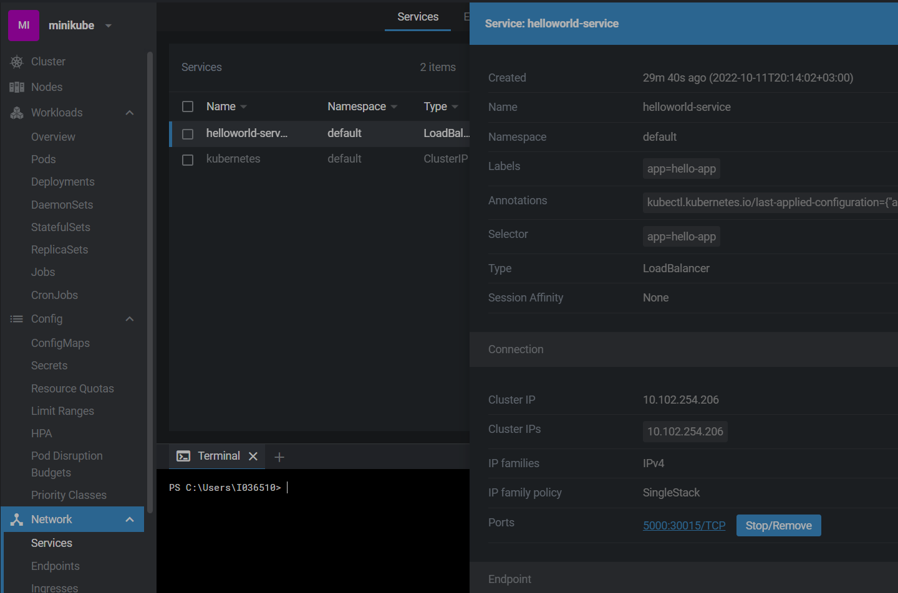
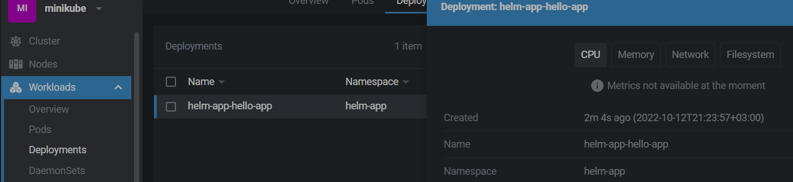
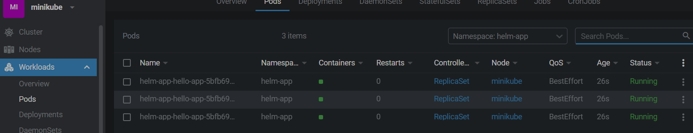
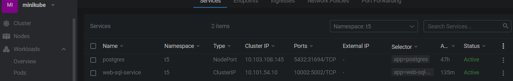
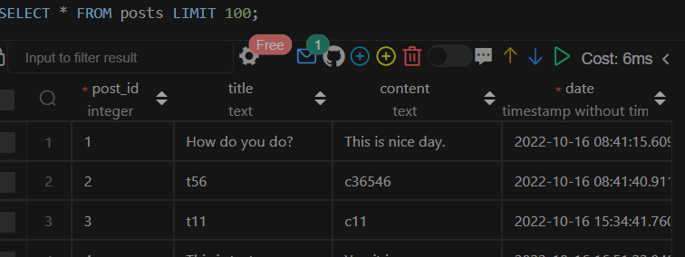
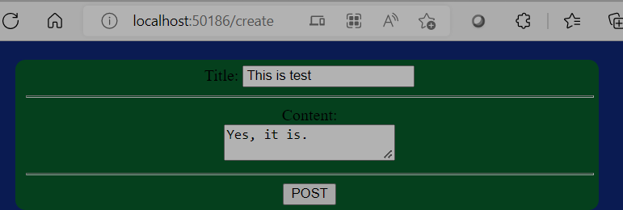
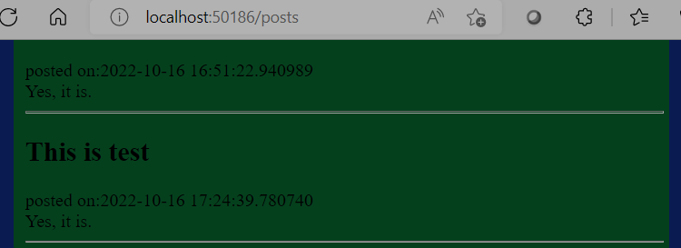

About this Repo
----------------

This is repo for following DevOps tasks:
1. Hello world application written on a python programming language running inside Docker
2. Local environment with docker and docker-compose
3. Automated docker build & push process with any CI tools like Github Actions.
4. Deploy to local Kubernetes environments - minikube.
5. Connect the application to SQL database running inside the mk k8s cluster
6. Deploy the application using helm

Installation and Set up
----------------

 - Clone the repo: `https://github.com/stkanev/dev_tasks.git`
 - Installation:
   - python
   - docker
   - docker-compose
   - kubectl
   - minikube
   - VSCode
   - helm
 - Setup:
   - VSCode
   - local env
   - etc.

Execution
----------------

- Local (dev) environment
  - [Task 1] It is used VSCode   
The simple pyton web app code is uvailable under [this repo](https://github.com/stkanev/dev_tasks.git)

  - [Task 2] Buld and run docker image with `docker-compose`
    ```
    $docker-compose build
      [+] Building 4.1s (12/12) FINISHED
    $docker-compose up # The app can be seen on http://localhost:5002/ 
      [+] Running 1/1
       Container dev_tasks_devtasks_1 Recreated   0.1s 
       Attaching to dev_tasks-devtasks-1
       ...
       Gracefully stopping... (press Ctrl+C again to force)
       Container dev_tasks-devtasks-1  Stopped    
    ```
- [Task 3] GitHub environment
  - The following Gihub Secrets must be set up 
  - Github Action CD worflow is trigered on a release event 
The produced docker image is uploaded to [dockerhub.com](https://hub.docker.com/r/stoyankanev/devtask/tags)

  - [Task 4] Deployment to minikube 
    ```
    # apply to k8s cluster
    $kubectl apply -f ./k8s/app-deployment.yaml
      deployment.apps/helloworld created
      service/helloworld-service created
    $kubectl.exe get deployment
      NAME         READY   UP-TO-DATE   AVAILABLE   AGE
      helloworld   2/2     2            2           49m
    # uninstall
    $kubectl delete -f ./k8s/app-deployment.yaml
      deployment.apps "helloworld" deleted
      service "helloworld-service" deleted

    ```
  - [Task 6] Deployment with helm 

    - Create helm chart
    ```
    # create an initail app
    $helm create hello-app
    # addapt the code to represent the k8s app
    # create the namespase helm-app 
    $kubectl create namespace helm-app
    ```
    - Install the app 
    ```
    $helm install helm-app ./helm/hello-app --namespace helm-app
      NAME: helm-app
      LAST DEPLOYED: Wed Oct 12 21:21:41 2022
      NAMESPACE: helm-app
      STATUS: deployed
      REVISION: 1
    ```
    

    ```
    $kubectl get deployment --namespace helm-app 
      NAME                 READY   UP-TO-DATE   AVAILABLE   AGE
      helm-app-hello-app   3/3     3            3           16m
    $kubectl get pod --namespace helm-app
      NAME                                  READY   STATUS    RESTARTS       AGE
      helm-app-hello-app-5bfb697654-kqcqc   1/1     Running   0              4m27s
      helm-app-hello-app-5bfb697654-mmwbh   1/1     Running   1 (2m6s ago)   4m27s
      helm-app-hello-app-5bfb697654-zb89p   1/1     Running   0              4m27s
    ```
    

    ```
    $helm uninstall helm-app --namespace helm-app
        release "helm-app" uninstalled
    ```
  - [Task 5] Connect the application to a Postgres database running inside the mk k8s cluster 

    - Implementation is available under ./sql folder.
    All 5 yaml files are applied in a separate namespase
    ```
    f.e.
    $kubectl apply -f .\postgres-service.yaml --namespace=t5
      service/postgres created
    $kubectl get all --namespace t5
      NAME                            READY   STATUS    RESTARTS   AGE
      pod/postgres-657bb64d5f-f4nsn   1/1     Running   0          2m18s
      NAME                       READY   UP-TO-DATE   AVAILABLE   AGE
      deployment.apps/postgres   1/1     1            1           2m18s
      NAME                                  DESIRED   CURRENT   READY   AGE
      replicaset.apps/postgres-657bb64d5f   1         1         1       2m18s
    $kubectl apply -f .\webapp-deployment.yaml --namespace t5
      deployment.apps/web-sql-app configured
      service/web-sql-service created
    ```
     
    - Based on a python PM and flask FW. There are to endpoints `/create` and `./posts`. The first on create an entry int db. The second one read all entries from the table db "posts"
    ```
    http://localhost:50186/posts # read all entries
    http://localhost:50186/create # create entry

    ``` 
    
    - Create endpoint
    
    - Posts endpoint - list posts
    


- .