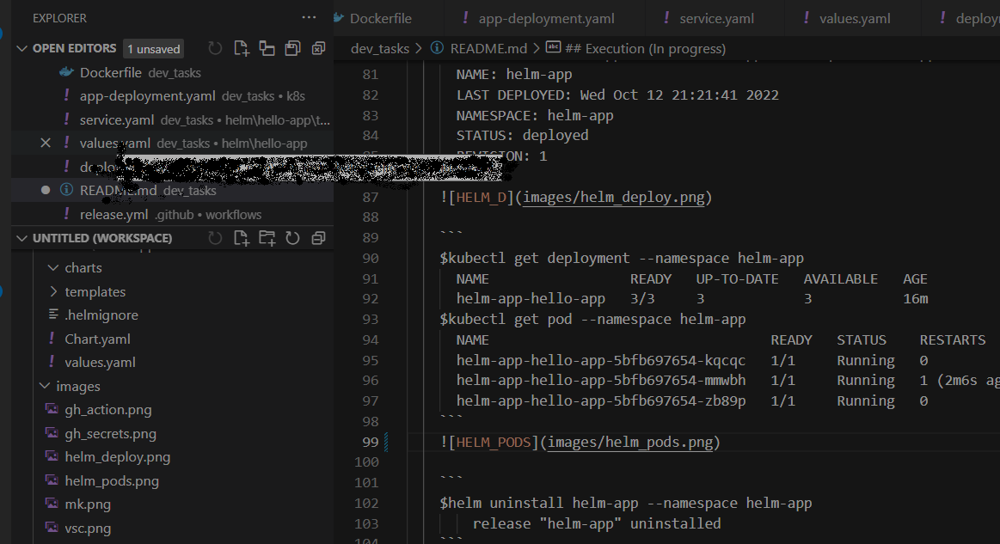

About this Repo
----------------

This is repo for following DevOps tasks:
1. Hello world application written on a python programming language running inside Docker
2. Local environment with docker and docker-compose
3. Automated docker build & push process with any CI tools like Github Actions.
4. Deploy to local Kubernetes environments - minikube.
5. Connect the application to SQL database running inside the mk k8s cluster
6. Deploy the application using helm

Installation and Set up (In progress)
----------------

 - Clone the repo: 'https://github.com/stkanev/dev_tasks.git'
 - Installation:
   - python
   - docker
   - docker-compose
   - kubectl
   - minikube
   - VSC
   - helm
 - Setup:
   - VSC
   - local env
   - etc.

Execution (In progress)
----------------

- Local (dev) environment
  - It is used VSC   
  - Buld and run docker image with docker-compose
    ```
    docker-compose build
    docker-compose up # The app can be seen on http://localhost:5002/ 
    ```
- GitHub environment
  - The following Gihub Secrets must be set up 
  - Github Action CD worflow is trigered on release event 
The produced docker image is uploaded to [dockerhub.com](https://hub.docker.com/r/stoyankanev/devtask/tags)

  - Deployment to minikube 
    ```
    kubectl apply -f ./k8s/app-deployment.yaml
    deployment.apps/helloworld created
    service/helloworld-service created
    ```

- Next.